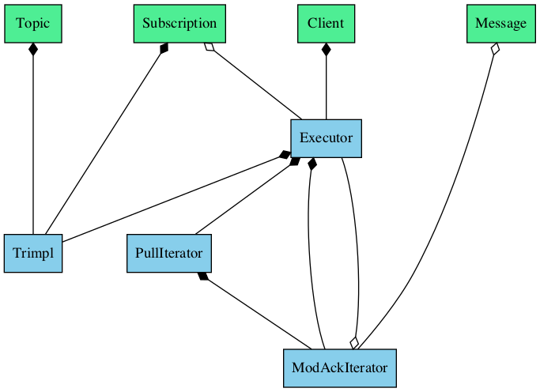

# Pubsuber design notes

The architecture of this library in many ways inspired by [Google Pubsub Go client](https://github.com/googleapis/google-cloud-go/tree/master/pubsub)
library modulo the fact that C++ does not have coroutines (yet).

Pubsuber consists of 2 threads and quite simple ownership hierarchy.
First  thread (Pull) is responsible for pulling messages from subscriptions.
Second thread (Ack) is responsible for message ack/nack and deadline extension functionality.

## Ownership diagram

Public API painted in green. Internal entities are in blue.

